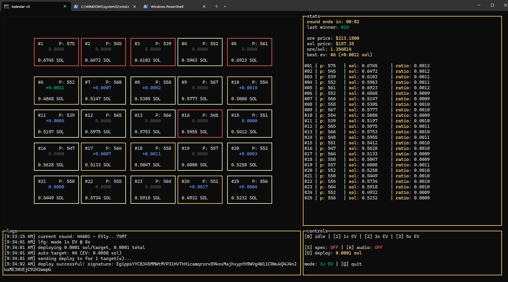

# 🌟lodestar-cli

> gm gm, lets mine & shine


**lodestar-cli** is a zero fee, terminal-based (TUI) automation bot for the ORE v3 blockchain game on Solana. It provides a real-time dashboard of the entire game board, calculates Expected Value (EV) for all 25 squares, and automatically deploys SOL to the most profitable squares based on your chosen strategy.

The bot uses a self-contained wallet system, automatic reward claiming, and anytime cash-out functionality to easily secure your profits.

## Features

* **Zero Admin Fee:** Every lamport counts when you're mining! That's why we have no hidden fees like the other apps. Keep the dev from starving to death by donating to: `oREVE663st4oVqRp31TdEKdjqUYmZkJ3Vofi1zEAPro`

* **Real-time TUI:** Visualizes the 25-square game board, player counts, SOL deployed, and EV/Ratio heatmaps.

* **Smart Automation:**
    * **1x EV:** Snipes the single best calculated square.
    * **3x / 5x EV:** Diversifies bets across the top profitable squares.
    * **25x EV:** Guaranteed return.

* **Integrated Wallet:** Automatically generates a local keypair (`id.json`). Includes built-in **Cash Out** functionality to send profits to your main wallet.

* **Auto-Update:** Checks against the GitHub repository on every launch to ensure you are always running the latest logic.

* **Spectate Mode:** Simulate strategies without spending real SOL.

* **Audio Alerts:** Optional sound notifications for wins and significant pool events.

## Prerequisites

* **Node.js**: Version 18+ recommended.
* **SOL:** You need an amount of SOL to fund the bot's operation.

## Installation

1. **Download the project** (Clone or Download ZIP).

```sh
git clone https://github.com/Radiants-DAO/lodestar-cli.git
```

2. **Navigate to the folder**:

```sh
cd lodestar-cli
```

3. **Install Dependencies**:

```sh
npm install
```

4. **Run the Application**

```sh
npm start
```

## Usage

To start the application, simply run:

```sh
npm start
```

## Wallet & Funding

lodestar-cli uses a dedicated "bot wallet" stored locally on your machine.

### 1\. First Run / Funding

When you run the app for the first time, the app will:

1. Generate a new Solana keypair.

2. Save it to `id.json` in the root folder.

3. **Display the address** and pause.

4. **Action Required:** You must send SOL (e.g., 0.1 SOL) to this address to fund the operations.

5. Once funded, restart the app.

### 2\. Cashing Out

You do not need to manually handle private keys to withdraw funds.

1. Press **`C`** in the dashboard.

2. Paste your destination wallet address (right-click to paste).

3. The bot will claim any pending SOL rewards and send the total wallet balance to your destination.

> **⚠️ Security Note:** Your `id.json` contains your private key in plain text. **Never share this file.** Ensure your machine is secure. This file is never transmitted elsewhere by lodestar-cli. This wallet is compatible with solana-cli and other tools- so even in the case of an extreme app failure (or the dev starves to death) your funds are safe and extractable.

## Controls

Navigation is entirely keyboard-based.

| Key | Function | Description |
| :--- | :--- | :--- |
| **`0`** | **Idle Mode** | Pauses all automation. No transactions will be sent. |
| **`1`** | **1x EV** | Deploys to the single square with the highest Expected Value. |
| **`2`** | **3x EV** | Deploys to the top 3 squares by EV. |
| **`3`** | **5x EV** | Deploys to the top 5 squares by EV. |
| **`4`** | **25x EV** | Deploys to all 25 squares. |
| **`S`** | **Spectate** | Toggles "Dry Run" mode. The bot calculates logic but does not send transactions. |
| **`D`** | **Deploy Amount** | Opens a prompt to set your bet size per square (in SOL). |
| **`A`** | **Audio** | Toggles sound effects. |
| **`C`** | **Cash Out** | Withdraw all funds and SOL rewards to an external wallet. |
| **`Q`** | **Quit** | Closes the application. |

## Troubleshooting

**"InvalidAccountData" or Automation Errors**

If the bot crashes repeatedly or fails to deploy due to account data mismatches, try:

```sh
npm run cleanup
npm run update
```

This will close the specific PDA accounts on-chain, reset your state then update and relaunch.

**Update Loop**

If the updater seems stuck or broken, you can bypass it and run the miner directly:

```sh
npm run miner
```

## Disclaimer

**Use at your own risk.**

This software is experimental. The ORE protocol involves financial risk. The authors of this software are not responsible for any financial losses, lost private keys, or failed transactions. Always audit the code yourself before running it with significant funds.
